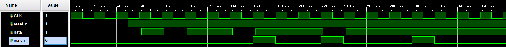

# FSM_1011_Sequence_Detector

串行输入 1011 序列检测器，支持重叠检测，三段式状态机实现

## 功能
- 检测串行输入序列 1011
- 支持重叠检测（如 1011011 可检出两次 1011）
- 检测到 1011 时，输出 match 拉高一个时钟周期

## 设计思路
- 三段式状态机：状态跳转（时序）、次态判断（组合）、输出逻辑（时序）分离
- 异步复位，低电平有效
- 独热码状态编码
- 外部输入 data 经两级同步，消除亚稳态

## 端口列表
- CLK：时钟，上升沿触发
- reset_n：异步复位，低电平有效
- data：串行输入数据
- match：检测到 1011 时拉高一个周期

## 文件说明
- FSM_1011.v：主模块
- FSM_1011_tb.v：仿真测试文件

## 仿真波形

## 运行方式
1. 用 Vivado 或 ModelSim 添加 .v 文件
2. 运行仿真，观察 match 输出
